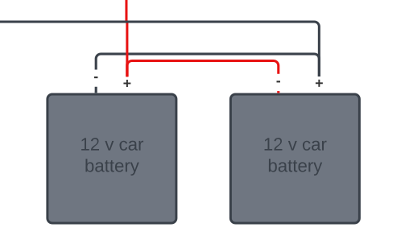

# Batteries
FishNET uses 2x 12 volt lead-acid car batteries wired in parallel.  A 50 Ah battery such as [this one](https://www.homedepot.com/p/MIGHTY-MAX-BATTERY-12-Volt-50-Ah-Rechargeable-Sealed-Lead-Acid-SLA-Battery-ML50-12411/308914341).  When wiring the batteries to the charge controller, wire the positive terminal of one end of the chain and the negative terminal of the opposite end of the chain:

This prevents voltage from dropping across the batteries and ensures that they are equally contributing to powering the system.