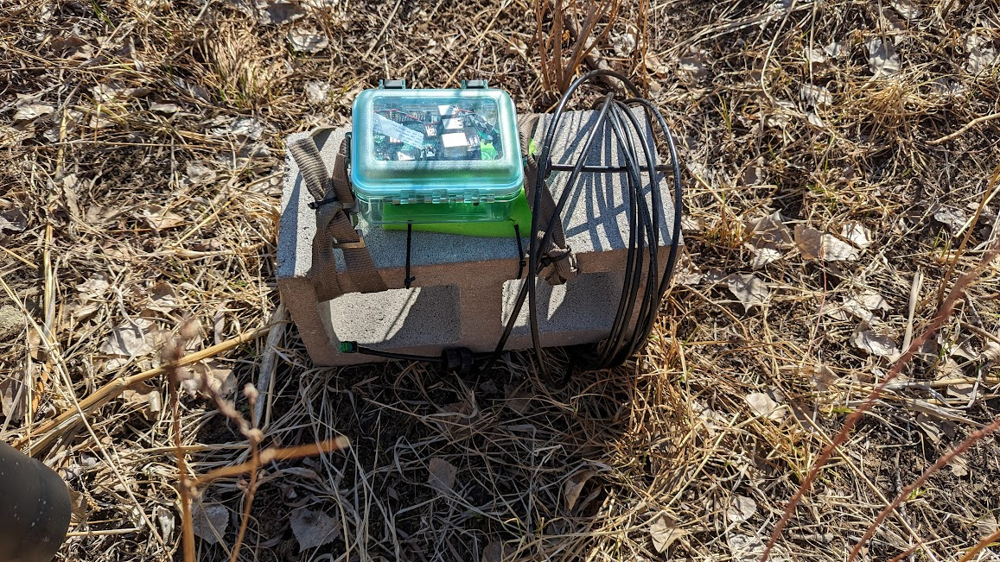

# Deployment

To deploy FishNET, the underwater enclosure was secured to riverbed by fastening it to a cinderblock:

For its first deployment, the FishNET hardware ran off of battery power without solar.  Networking equipment including the radio antenna was not used, and video was stored locally on the pi.

We recommend keeping detailed field notes when deploying the system to help with troubleshooting and to make your results reproducible.

## Field Notes
- The water level was low for the section of the creek
- Approximately 9.6 inches of water
- We took turbidity readings of the water using two different methods
	1. Digital turbidity meter: measured to be 1.27 NTU (Nephelometric Turbidity Units)
		1. NTUs measure the number of suspended particles in water.  1 mg/l (ppm) is equivalent to 3 NTU
		2. 1.27 NTU corresponds to 0.4233 mg/l (ppm) suspended solids
	2. Visual metric: visibility of greater than 120 cm
- Overall, the conditions on this day were extremely optimal and we do not expect camera visibility to be a problem (weather permitting)
- We spotted several local species in the pool where the camera was deployed
	- Creek Chub
	- Leeches
	- Crawdads

## Deployment Pictures

