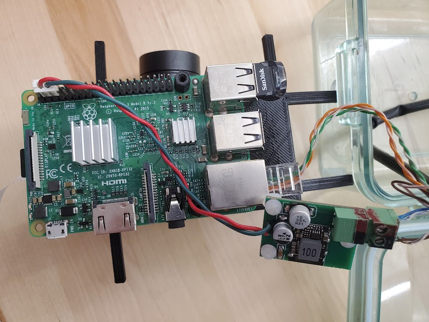

# Power over Ethernet
the system uses unofficial power over Ethernet to provide power to both the [network equipment](connectivity.md) and to the [Raspberry pi](Raspberry-pi.md)

12 volt power is spliced into the Ethernet cable from the battery and sent to the radio and [underwater enclosure](enclosure.md).  Within the box, the 12 volt power is converted into 5 volts by a circuit using the [STS1024S05](https://www.digikey.com/en/products/detail/xp-power/STS1024S05/9598118) DC to DC converter.  

This method is used instead of a standard POE injector to improve system efficiency.