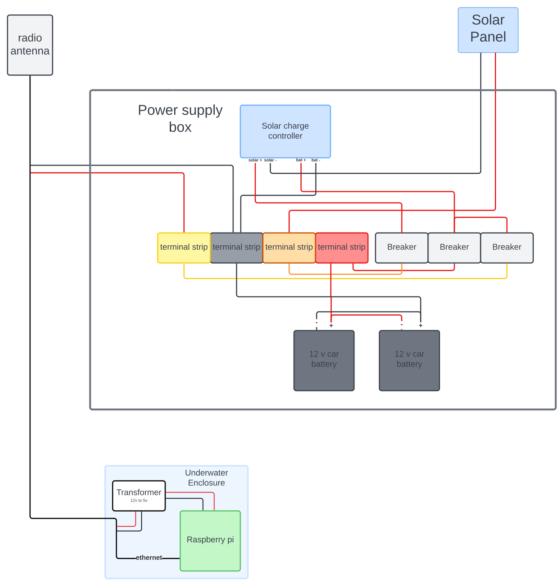

# Power

## Power supply box
the wiring in the power supply box is set up to be easy to deactivate any of the 3 components: The batteries, The (solar) power input, and The power output. each subsystem can be turned off temporarily for testing, but will also be deactivated in the case of a short circuit to prevent damage to other components.
## Power input
- [ ] find the power output of the solar panel
The power supply box takes power from a solar panel, and feeds it into a charge controller, which prevents the batteries from being overcharged, which can lead to damage to the battery and become a fire hazzard.
## Power output
Power is output from the power supply in 2 12v POE ports on the side of the box which is used to supply power to the [underwater enclosure](enclosure) and to [connectivity equipment](connectivity). 
## Batteries
- [ ] find the energy storage of the batteries
Power is stored in 2 lead acid batteries wired in parallel. The batteries hold enough power to sustain the bare minimum system for over a week.
