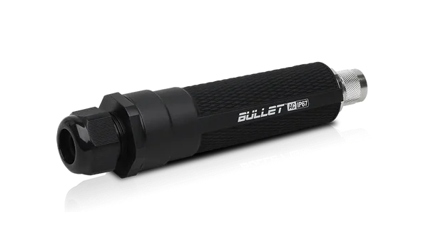

# Connectivity
The system is designed to be used with a 12 volt power over Ethernet radio antenna to stream data in real time to the cloud to be processed.



Our system used the [Ubiqiuti airMAX Bullet AC Dual-Band Radio](https://store.ui.com/collections/wireless/products/bullet-ac-ip67-1?_pos=3&_sid=166db66cb&_ss=r) to act  
as an access point (AP) in a Point-to-Point (PtP) link.  This involves setting up one radio as an access point in a location with access to the internet.  The other radio is configured as a client and is wired via Ethernet to the camera Pi.  See the [Quickstart Guide](https://dl.ui.com/qsg/BulletAC-IP67/BulletAC-IP67_EN.html) or [airOS Documentation](https://dl.ubnt.com/guides/airOS/airOS_UG_V80.pdf#page=17) for more information about configuring the radios.

The Ethernet line for the radio can also be connected to a laptop to verify that the system is functional during deployment.

## Watchdog On the Camera Pi
A watchdog is a program that ensures that the programs on the camera Pi are running properly.  When FishNET is configured to connect to the internet as described above, it is vital to ensure that this connectivity is upheld during the course of deployment.  This is a primary use case of a watchdog script on the camera Pi.

An implementation of such a watchdog script can be found at https://github.com/SVVSDICAI/FishNetStreamAnalyzer/tree/main/watchdog.  This script monitors that a website (Eg a streaming service website such as YouTube) can be pinged successfully, and power cycles the Pi if the ping fails too many times.  To specify the desired target site, change the `'host'` variable, as well as the connection type (`wlan` for WiFi or `ethN` where N is the Ethernet interface number) located at the top of [watchdog.py](https://github.com/SVVSDICAI/FishNetStreamAnalyzer/blob/main/watchdog/watchdog.py):
```python
host = 'www.youtube.com' # change to your desired host site

connection = 'wlan' # change to the connection type used by the Pi
```

## possible improvements 
- the radio we used can be used as part of a mesh network, multiple systems could be used to survey a large amount of water at once, and could possibly be paired with other remote measurement devices.