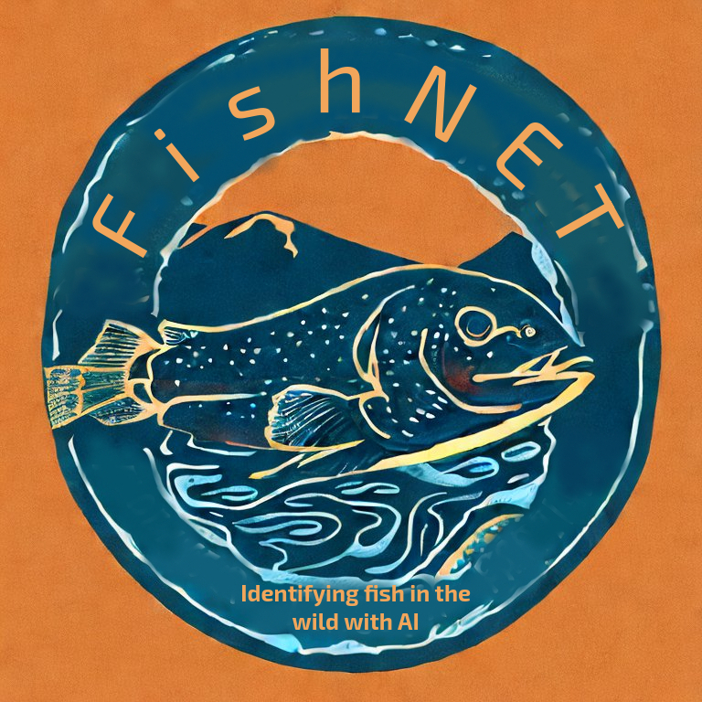

# Fishnet 
## Identifying Fish in the Wild with AI

It is important to know what kinds of fish are in local rivers so we know how healthy those rivers are. It turns out, figuring out what species of fish are in local rivers is quite difficult. According to wildlife experts, fish conservation as it stands today is resource intensive and inefficiently designed.

The exciting technology of Artificial Intelligence (AI) could be used to improve traditional fish counting methods. We developed just such a solution, called **FishNET**. FishNET is an underwater camera that looks for fish. The video that it captures is monitored by an AI backend that can Identify five local fish species: Black bullhead catfish, Brown trout, Creek chub, Plains topminnow, and White sucker.

## Hardware
- #### Power System
	- [batteries](../Batteries.md)
	- [solar](../Solar.md)
- #### Cameras
	- [camera](../camera.md)
- #### Raspberry Pi
	- [Raspberry-pi](../Raspberry-pi.md)
- #### Enclosure
	- [enclosure](../enclosure.md)
- #### Power over Ethernet
	- [POE](../POE.md)
- #### Connectivity
	- [connectivity](../connectivity.md)
- #### Bill of Materials
	- [bill of materials](../BillOfMaterials.md)

## Software
- ### Remote camera
	- #### Livestreaming
		- [livestreaming](../livestreaming.md)
	- #### Recording 
		- [recording](../recording.md)
- ### Model
	- [image processing](../ImageProcessing.md)
	- [approaches to training the model](../ApproachesToTrainingTheModel.md)
	- [implementing the model](../ImplementingTheModle)
	- [the complete pipeline](../TheCompletePipeline.md)

## Deployment
- ### Pre deployment checklist
	- [Pre-Deployment](../Pre-Deployment.md)
- ### Deployment process
	- [Deployment](../Deployment.md)
- ### Results
	- [Results](../Results.md)