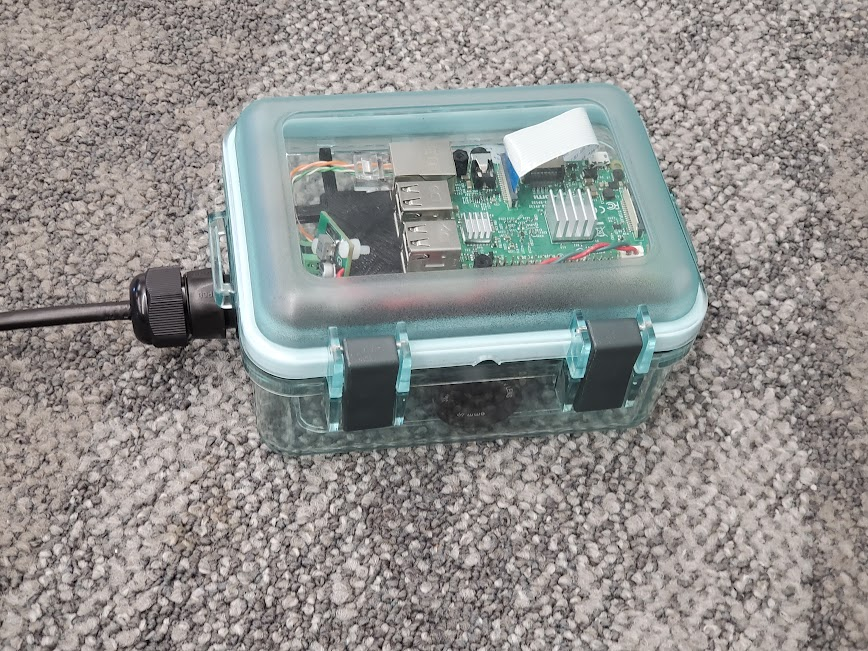
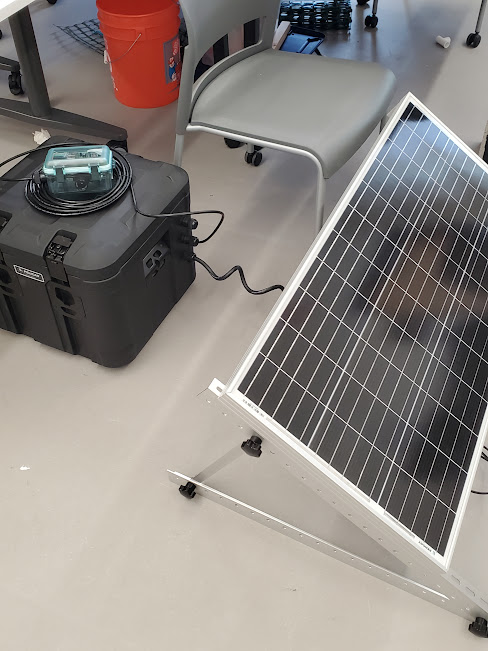

# Underwater Enclosure
The underwater enclosure serves to keep the [Raspberry-pi](Raspberry-pi), [camera](camera), and [POE](POE) systems dry and organized underwater

## Organization
The enclosure contains a 3D printed bracket with heat set standoff inserts to keep the [raspberry pi](./Raspberry-pi) and [camera](./camera) fixed in place during use.

## Cables
The enclosure is connected by an Ethernet cable. The cable connects the raspberry pi to the [networking equipment](../connectivity) and to the [power system](./Power).

### power
the Ethernet cable supplies 12 volt [power over Ethernet](./POE) to the box, but as the raspberry pi is run off of 5v power the power lines are run through a high efficiency step down circuit and into the raspberry pi using the GPIO power pins.

## Waterproofing
The enclosure uses a gasket to keep the seal around the hinge waterproofed. The Ethernet is waterproofed using a water resistant bulkhead.

## Possible Improvements
- batteries inside the enclosure
	- decreases buoyancy of the enclosure so a cinder block isn't needed to keep it on the riverbed

# Battery Enclosure
For the first FishNET prototype, the size of the [batteries](./Batteries.md) necessitated they be stored separately from the camera, and above water.  For this reason, an above-ground enclosure was constructed using a weather-proof [Pelican Case](https://overlandaddict.com/products/pelican-bx50-cargo-case).  The batteries, and solar charge controller were mounted in this box.  Holes were drilled in the sides to allow for power and Ethernet to pass through the same bulkhead connectors used in the underwater box.

## Possible Improvements
- The need for the battery box could be mitigated by using smaller batteries capable of fitting in the underwater enclosure.